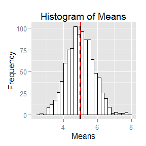

# Statistical Inference Project Part 1
Aaron Augustine  
July 22, 2015  

#Report Overivew
The purpose of this will illustrate through a simulation exercise the properties of the distribution of the mean of 40 exponentials. It will include details on (a) Sample Mean versus Theoretical Mean, (b) Sample Variance versus Theoretical Variance and (c) Show that the distribution is approximately normal.  To make it easier to understand the results I've combined the report and figures together.

#Execute the simulation
First we will execute the simulation. 


 
Then execute the simulations using the parameters below.

```r
set.seed(9867)
lambda <-.2
number_sim <-1000
sample_size <- 40
data<-matrix(rexp(number_sim*sample_size, lambda),number_sim,sample_size)
```

#Results
##Sample Mean versus Theoretical Mean

The sample mean is 4.995101 and the theorectical mean is 5.  The plot below gives a visual of the simulation along with the sample ("black line") and theorectical mean ("red line").
 
 


##Sample Variance versus Theoretical Variance  
The sample variance is the variance of the sample means with a value of 0.6376136. The theorectical variance is variance of the exponential distribution (1/lambad)^2 divided by the sample size, 0.625.  

##Show the distribution is normal.
The distribution of sample means are normally distributed.  To demonstrate this below is the probability density of the sample means (black line) of 40 exponentials from 1000 simulations along side the normal distribution with a mean of 5 and variance of 0.625.   You'll notice they are very close.  The key to this being normal is that we are taking averages of 40 exponentials versus a large collection of exponentials.

 
