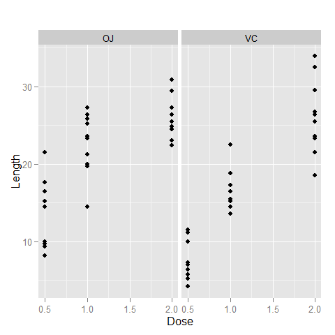

# Statistical Inference Project Part 2
Aaron Augustine  
July 22, 2015  
#Background
The purpose of this document is to analyse the ToothGrowth Data in R.  This will include:

1. Load the ToothGrowth data and perform some basic exploratory data analyses, 

2. Provide a basic summary of the data, and 

3. Use confidence intervals and/or hypothesis tests to compare tooth growth by supp and dose 

#Analysis
## Load the ToothGrowth data and perform some basic exploratory data analyses
First we set the relevant working directory and libraries. Then we load in the the data. After than we can run a series of functions to get a feel for the data.  The code and results for this part are given in the Appendix.


##Provide a basic summary of the data
A great summary of the data can be found at  https://class.coursera.org/statinference-030/forum/thread?thread_id=26.

## Use confidence intervals and/or hypothesis tests to compare tooth growth by supp and dose
For this section we will conduct 3 hypothesis using non paired T-tests, one for each dose level.  In each case we will test the null hypotheis that the mean length of the odontoblast cells is the same between the form of Orange Juice (OJ) or chemically pure Vitamin C in aqueous solution (VC).  In each case we are assuming unequal variances. 

```r
doselist <- unique(ToothGrowth$dose)
for (i in doselist) {
    print(paste("T-Test for Dose Level", i))
    print(t.test(len~supp,data = ToothGrowth, alternative= c("two.sided"), mu=0,
         paired=FALSE, var.equal=FALSE, conf.level= .95, subset=ToothGrowth$dose==i))
}
```

```
## [1] "T-Test for Dose Level 0.5"
## 
## 	Welch Two Sample t-test
## 
## data:  len by supp
## t = 3.1697, df = 14.969, p-value = 0.006359
## alternative hypothesis: true difference in means is not equal to 0
## 95 percent confidence interval:
##  1.719057 8.780943
## sample estimates:
## mean in group OJ mean in group VC 
##            13.23             7.98 
## 
## [1] "T-Test for Dose Level 1"
## 
## 	Welch Two Sample t-test
## 
## data:  len by supp
## t = 4.0328, df = 15.358, p-value = 0.001038
## alternative hypothesis: true difference in means is not equal to 0
## 95 percent confidence interval:
##  2.802148 9.057852
## sample estimates:
## mean in group OJ mean in group VC 
##            22.70            16.77 
## 
## [1] "T-Test for Dose Level 2"
## 
## 	Welch Two Sample t-test
## 
## data:  len by supp
## t = -0.046136, df = 14.04, p-value = 0.9639
## alternative hypothesis: true difference in means is not equal to 0
## 95 percent confidence interval:
##  -3.79807  3.63807
## sample estimates:
## mean in group OJ mean in group VC 
##            26.06            26.14
```
For dose levels .5 and 1 we reject the null hypotheis that the means are equal since they both have p-values less than .05.  For does level 2, we fail to reject the null hypothesis since the p-value is greater than .05.

Appendix

```r
head(ToothGrowth)
```

```
##    len supp dose
## 1  4.2   VC  0.5
## 2 11.5   VC  0.5
## 3  7.3   VC  0.5
## 4  5.8   VC  0.5
## 5  6.4   VC  0.5
## 6 10.0   VC  0.5
```

```r
str(ToothGrowth)
```

```
## 'data.frame':	60 obs. of  3 variables:
##  $ len : num  4.2 11.5 7.3 5.8 6.4 10 11.2 11.2 5.2 7 ...
##  $ supp: Factor w/ 2 levels "OJ","VC": 2 2 2 2 2 2 2 2 2 2 ...
##  $ dose: num  0.5 0.5 0.5 0.5 0.5 0.5 0.5 0.5 0.5 0.5 ...
```

```r
with(ToothGrowth,table(supp,dose))
```

```
##     dose
## supp 0.5  1  2
##   OJ  10 10 10
##   VC  10 10 10
```

```r
qplot(dose,len,data=ToothGrowth, xlab="Dose", ylab="Length", main="", facets=.~supp)
```

 

